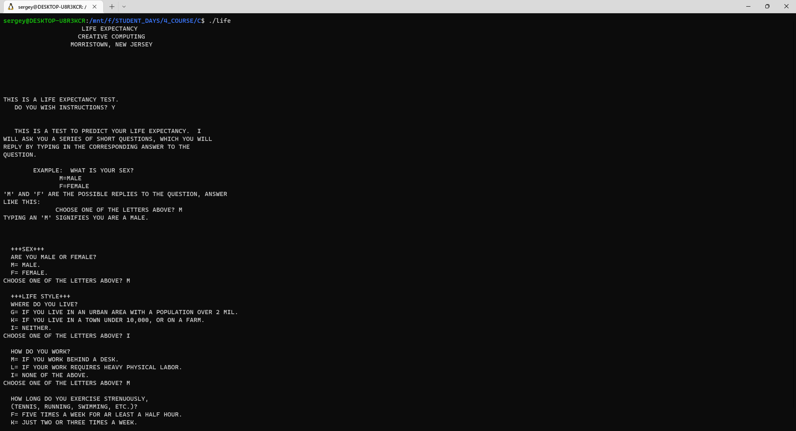
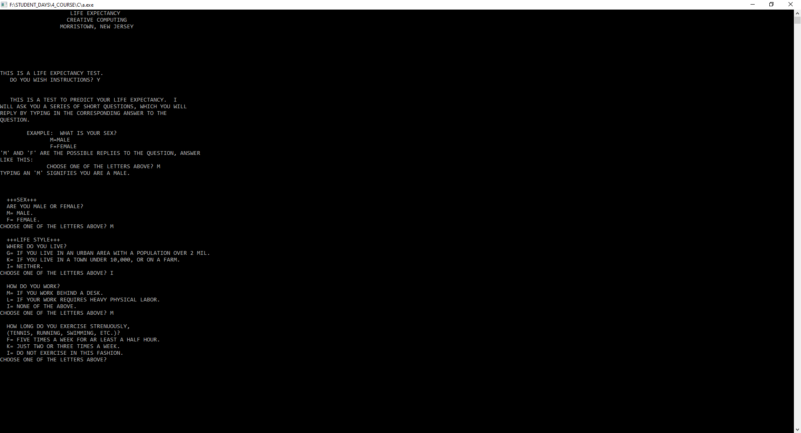
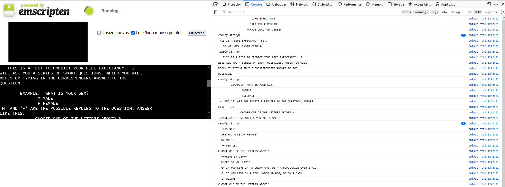
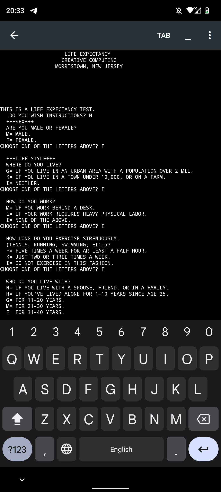

# About
This project is reconstruction of life-expectancy game from BASIC to C.

## Working on Linux
To run game on Linux you need to download gcc compiler:
- `sudo apt update`
- `sudo apt install build-essential`

Then compile file with source code:
- `gcc life-expectancy.c -o life` where `life` is name of compiled file

Then run:
- `./life` to launch the game.

------------------

## Working on Windows
To run game on Windows you need to install MinGW-w64, then create file `make.bat` in directory where your source code is and write strings listed below:
- `PATH=path to mingw64/bin`
- `gcc -std=c99 -Wall -Wpedantic application.c`

Then for example in VS Code open terminal and type:
- `./make.bat`

Then run `a.exe` application.

------------------

## Working on WEB

------------------

## Working on Android

------------------