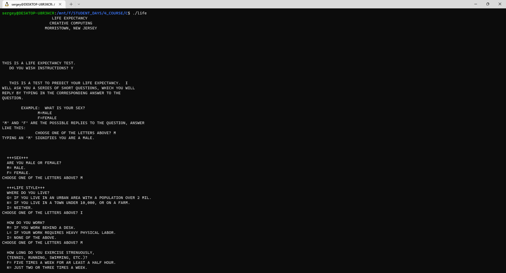
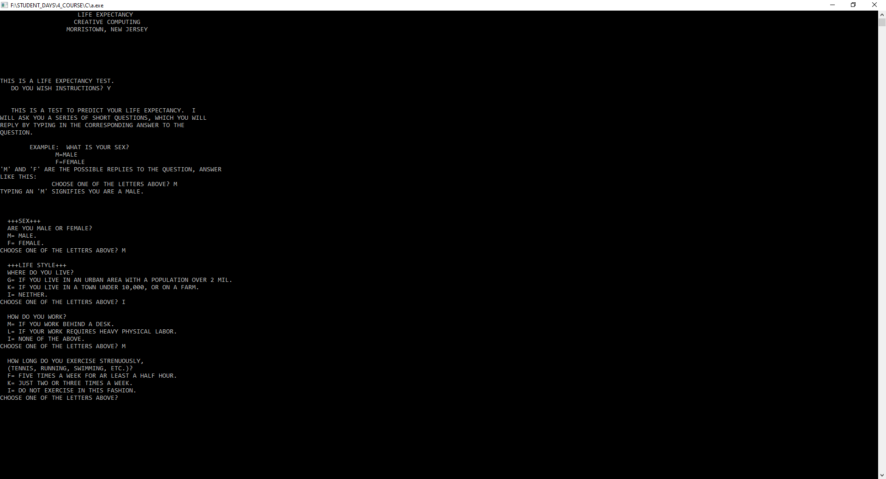
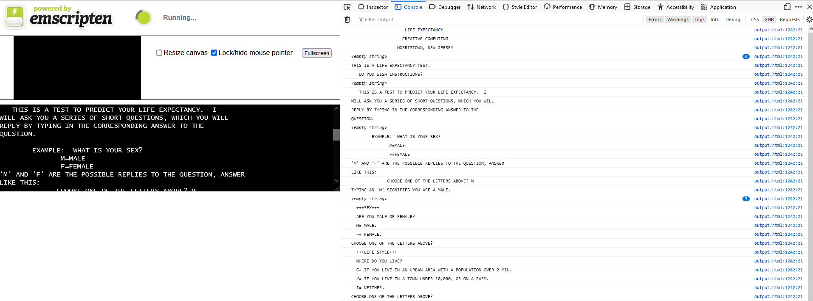
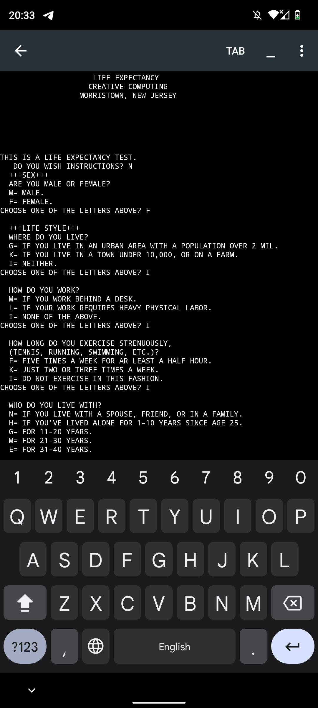

# About
This project is reconstruction of life-expectancy game from BASIC to C.

## Working on Linux
To ru game on Linux you need to download gcc compiler:
- `sudo apt update`
- `sudo apt install build-essential`

Then compile file with source code:
- `gcc life-expectancy.c -o life` where `life` is name of compiled file

Then run:
- `./life` to launch the game.

------------------

## Working on Windows
To run game on Windows you need to install MinGW-w64, then create file `make.bat` in directory where your source code is and write strings listed below:
- `PATH=path to mingw64/bin`
- `gcc -std=c99 -Wall -Wpedantic life-expectancy.c`

Then for example in VS Code open terminal and type:
- `./make.bat`

Then run `a.exe` application.

------------------

## Working on WEB
To run game on WEB you need to convert C code to JS using Emscripten. First of all install it, it's better to do it on Linux:
- `git clone https://github.com/emscripten-core/emsdk.git`
- `cd emsdk`
- `./emsdk install latest`
- `./emsdk activate latest`
- `source ./emsdk_env.sh` - to activate PATH and other environment variables in the current terminal

Then run:
- `emcc life-expectancy.c -s NO_EXIT_RUNTIME=0 -o output.html`

This command will generate html page with JS script. It's important to place all generated files to folder on your runnung LOCAL HTTP server.

------------------

## Working on Android
To run game on Android you need to download and install C/C++ compiler for example from Google Play. Then save file with source code from this repository with `.c` extension and run compiler.

------------------